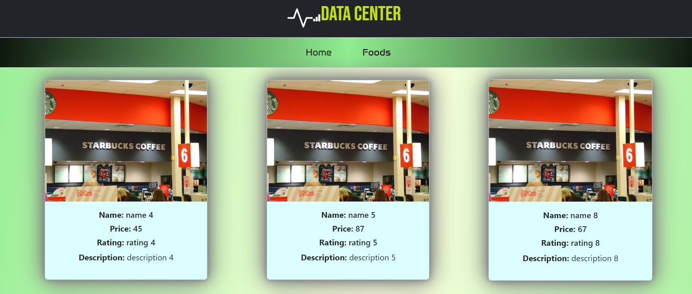

# ✒ IN THIS REPOSITORY
## 📍CRUD Operation Using React and Axios 

### You can see output in 📌[Netlify.com]()


+ Here im using `routes` to Navigate between Components

### 📢Default Syntax for create Router🔐
```javascript
 <BrowserRouter>
    <Router>
        <Routes path='/' element={<Home />} />
        <Routes path='/user' element={<User />} />
    </Router>
 </BrowserRouter>
```
+ And createing Navbar with Linked `Bootstrap` and displaying details in `card` 
### Installing React Application
```
PS D:\React\day> npm create vite@latest project-name
√ Select a framework: » React
√ Select a variant: » JavaScript
Done.
Now run:
  cd project-name
  npm install
  npm run dev
 
PS D:\React\day1\project-name> npm install
PS D:\React\day1\project-name> npm run dev
> myday1project@0.0.0 dev
> vite
  VITE v4.4.9  ready in 985 ms
  ➜  Local:   http://localhost:5173/

```
### Installing axios and Router
```command prompt
 ⚙ npm i react-router-dom 
  
 ⚙ npm i axios
```